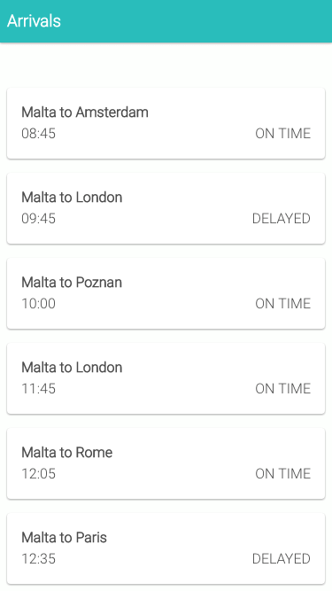
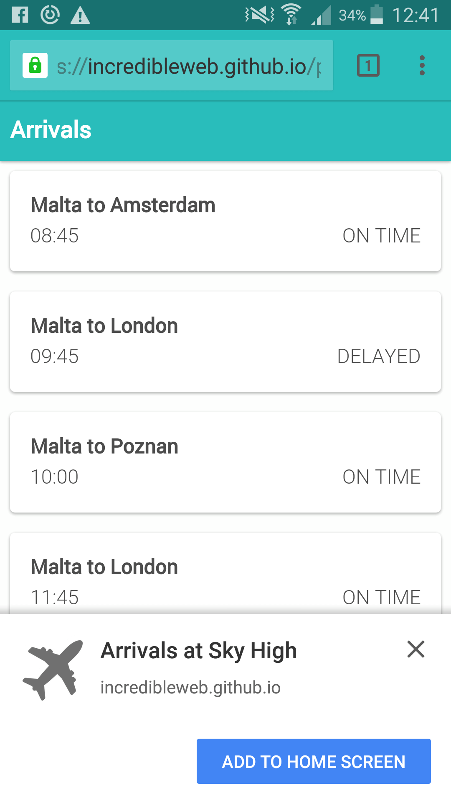
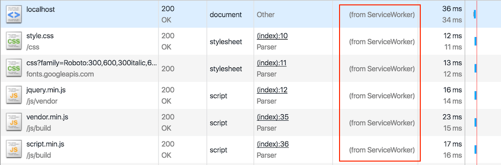
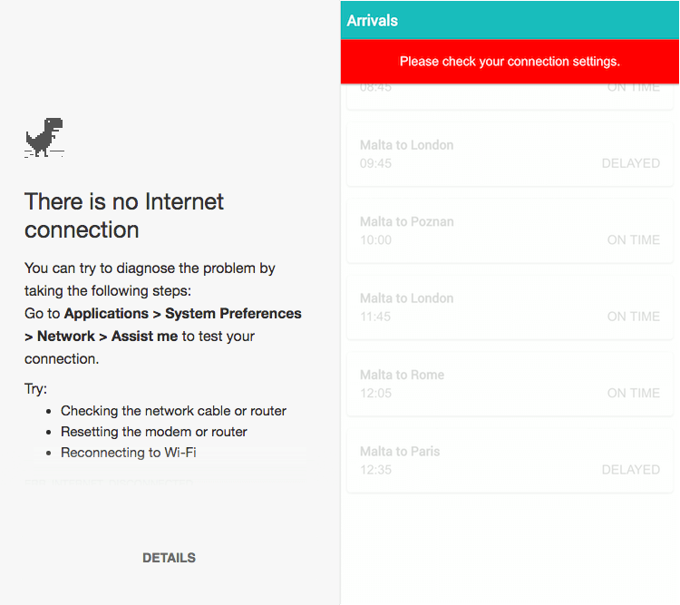
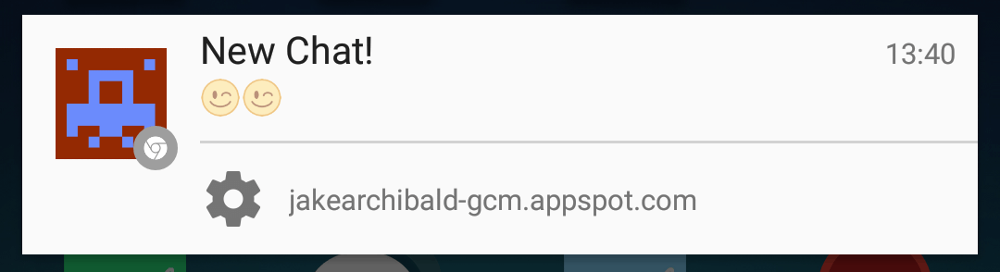

## Progressive Web App入门指南

> 本文翻译来自https://www.smashingmagazine.com/2016/08/a-beginners-guide-to-progressive-web-apps/。有兴趣的同学可以点击[阅读原文](https://www.smashingmagazine.com/2016/08/a-beginners-guide-to-progressive-web-apps/)

Progressive web app(以下简称PWA)的出现为移动web开发带来了一次大的变革。自从Google在2015年推出PWA以来，由于其相对简单的开发过程以及在应用的用户体验方面带来的明显提升，已经吸引了大量的关注。

PWA应用使用最新的技术，将web和原生应用各自的优点结合到一起。可以看成是使用web技术开发了一个web站点，但是运行起来却像是一个原生应用。得益于浏览器自身的新特性，service worker提供的能力以及Cache API和Push API，用户可以将web应用安装到主屏，接收到推送的消息，甚至可以离线运行应用。  

相比于应用市场上的原生应用，开发和维护一个web站点会来的更加简单，同时还能使用各种成熟的插件和解决方案，拥有更加庞大的web生态系统以及活跃的开发社区的支持。如果你有原生应用和web开发的经验，你就会了解构建一个web站点花费的时间更少，而且不用考虑API的向下兼容(所有用户运行的都是相同版本的网站代码，不像原生应用一样有不同的版本)，同时web应用更容易发布和维护。

### 为什么要选择Progeressive Web App

有项研究表明，平均来说，在用户从知道一个应用到开始使用该应用之前，每多一个步骤就会使该应用损失20%的用户。用户首先需要从应用市场找到这个应用，接着下载，安装，最后打开应用。然而，当用户发现你开发的PWA应用时，他可以立即开始使用，省去了不必要的下载和安装的过程。当用户回到该应用的时候，会提示他进行安装，并且可以全屏运行，从而提升了用户体验。

当然，原生应用并不是一无是处。拥有消息推送功能的移动应用比没有推送功能的拥有高达三倍的留存率，也就是说相比于一个站点，用户有三倍的可能性会去重新打开一个移动应用。除此之外，设计良好的移动应用会将一些资源进行缓存，常驻设备，从而减少数据请求，使运行更流畅。

PWA应用具备这些良好的特性，提升了用户的留存率和应用的性能，同时又避免了维护一个原生应用的复杂性。

#### 案例

什么时候你需要开发一个PWA应用呢？通常我们开发原生应用是希望用户能经常使用它，对于PWA应用来说也是一样。[Flipkart](http://www.flipkart.com/)下著名的电子商务平台Flipkart Lite就是一个PWA应用，同样的还有[Air Berlin](https://flights.airberlin.com/en-DE/progressive-web-app)开发了PWA应用，实现在线登记功能，允许用户在没有网络的情况下也能查看他们的机票。

当你还在思考应该开发一个PWA应用，还是web站点或者原生应用的时候，你首先应该了解相应的用户群以及最重要的操作是什么。要做到“渐进(progressive)”，一个PWA应用要能保证在所有浏览器中运行，同时当用户的浏览器升级到支持新的特性和API时，用户体验也能得到相应提升。

因此，与传统的web站点相比，PWA应用没有在用户体验上作出妥协，但是，你需要决定支持哪些功能的离线操作，而且要提供更方便的导航(记住在独立运行模式下，用户是无权操作后退按钮的)。如果你的web站点已经拥有了类似原生应用的界面，使用PWA应用的开发理念会使其更加完美。

如果某些重要的功能是用户操作不可或缺的，但目前又缺少跨浏览器支持的话，开发一个原生应用或许是更好的选择，这样能保证一致的用户体验。

### Progeressive Web App的特点

在我们接触具体的代码之前，需要先了解一下PWA应用拥有的以下这些特点：

**渐进增强(Progressive)**

定义里已经阐述了，一个PWA应用必须保证能在所有的设备上运行，同时根据用户设备和浏览器的支持情况实现功能的渐进增强。

**可发现性(Discoverable)**

因为PWA应用本质上是一个web站点，所以可以被搜索引擎搜索到。原生应用在可搜索性上远远落后于web站点，这是PWA应用的一个很大的优势。

**可链接性(Linkable)**

这是继承自web站点的另一个优势，设计良好的web站点可以使用URI来表示应用当前的状态。当用户将当前web应用保存为书签或者将该URL分享出去的时候，该应用可以保持或者重载当前的状态。

**响应式用户界面(Responsive)**

PWA应用必须能够适配不同的设备和屏幕尺寸。

**类原生应用(App-like)**

PWA应用应该拥有和原生应用类似的界面和体验，同时基于application shell模型构建，尽可能减少页面的刷新。

**不依赖网络连接(Connectivity-independent)**

能够在较差的网络连接状况或者完全离线状态下运行(这也是我们最喜欢的特性)。

**多次访问(Re-engageable)**

原生应用的用户愿意频繁使用它，PWA应用通过使用消息推送等功能也可以达到相同的目的。

**可安装(Installable)**

PWA应用可以安装在设备的主屏上，方便用户随时打开使用。

**持续更新(Fresh)**

当新内容发布并且用户处于网络连接状态，应用可以实时获取这些内容。

**安全(Safe)**

因为PWA应用提供了更加亲密的用户体验，并且所有的网络请求都可以被service worker拦截，因此应用必须通过HTTPS访问来防止"中间人攻击"。

### 开始写代码吧！

来创建我们的第一个PWA应用，Sky High，用来模拟机场的到达航班时刻表。用户首次打开应用，我们将会展示从接口获取的即将到达航班的信息。如果用户在没有网络连接的情况下重新加载了我们的web应用，我们希望能继续展示最后一次有网络连接时加载的航班到达时刻表。

### 基础

PWA应用的第一个特点就是必须保证它能在所有的设备和浏览器上能够运行，同时在设备和浏览器支持的情况下进行功能增强。因此，我们使用传统的HTML5和Javascript来构建界面，同时通过从一个模拟的接口获取数据来展示航班到达信息。在我们的应用中，使用了轻量级的Javascript框架Knockout，来处理Model-View-ViewModel (MVVM)绑定操作，将我们的Javascript模型和HTML视图进行绑定。我们之所以使用Knockout是因为它相对容易理解，而且不会使代码变得混乱；当然，你也可以选择其他的框架，比如React或者AngularJS。

我们的站点遵循Google提出的[material design](https://material.io/guidelines/)规范，这是一套用来指导设计和交互的准则。material design不仅可以用来作为不同应用和设备统一的视觉交互规范，同时它也为设计赋予了含义。我们在Sky High的航班到达界面就使用了material design，使我们的应用看起来和使用起来更接近原生应用的体验。

最后，我们对应用进行了测试，确保它有较好的性能，不会出现丢帧现象，滚动流畅顺滑。无丢帧渲染已经被证明会提高用户对应用的使用率。我们的目标就是保证每秒能够渲染60帧。

为了简单起见，在这个示例中，我们并没有使用真正的接口，而只是从静态的JSON文件获取数据。在真实的使用场景中，你需要通过请求接口或者WebSockets来获取数据。

`index.html`

    <!DOCTYPE html>
    <html lang="en">

    <head>
        <meta charset="utf-8">
        <meta name="viewport" content="width=device-width, initial-scale=1.0">
        <title>Sky-High Airport Arrivals</title>
        <link async rel="stylesheet" href="./css/style.css">
        <link href="https://fonts.googleapis.com/css?family=Roboto:300,600,300italic,600italic" rel="stylesheet" type="text/css">
    </head>

    <body>
        <header>
            

                <h3>Arrivals</h3>
            

        </header>
        

            

                <ul class="arrivals-list" data-bind="foreach: arrivals">
                    <li class="item">
                        
                        
                        
                    </li>
                </ul>
            

        

        
        
    </body>

    </html>

`index.html`是标准的html文件。我们创建了一个列表，并且使用Knockout框架，通过添加`data-bind="foreach: arrivals"`属性，将视图模型`arrivals`绑定到该列表上。视图模型`arrivals`是在`page.js`文件中定义的，并且挂载到了`Page`模块下，具体代码如下。在我们HTML页面中，对于`arrivals`数组中的每一项，我们都将`title`，`status`和`time`属性绑定到了HTML视图上。

`page.js`

    (var Page = (function() {

        // declare the view model used within the page
        function ViewModel() {
            var self = this;
            self.arrivals = ko.observableArray([]);
        }

        // expose the view model through the Page module
        return {
            vm: new ViewModel(),
            hideOfflineWarning: function() {
                // enable the live data
                document.querySelector(".arrivals-list").classList.remove('loading')
                // remove the offline message
                document.getElementById("offline").remove();
                // load the live data
            },
            showOfflineWarning: function() {
                // disable the live data
                document.querySelector(".arrivals-list").classList.add('loading')
                    // load html template informing the user they are offline
                var request = new XMLHttpRequest();
                request.open('GET', './offline.html', true);

                request.onload = function() {
                    if (request.status === 200) {
                        // success
                        // create offline element with HTML loaded from offline.html template
                        var offlineMessageElement = document.createElement("div");
                        offlineMessageElement.setAttribute("id", "offline");
                        offlineMessageElement.innerHTML = request.responseText;
                        document.getElementById("main").appendChild(offlineMessageElement);
                    } else {
                        // error retrieving file
                        console.warn('Error retrieving offline.html');
                    }
                };

                request.onerror = function() {
                    // network errors
                    console.error('Connection error');
                };

                request.send();
            }
        }

    })();

`page.js`对外暴露了`Page`模块，包含了我们定义的视图模型`vm`以及两个函数`hideOfflineWarning`和`showOfflineWarning`。`ViewModel`是Javascript中的简单构造函数，用来创建视图模型对象实例。实例属性`arrivals`是Knockout中的`observableArray`，能自动将我们的HTML视图和Javascript中的数组进行绑定，当我们对数组进行push或pop操作时，页面的HTML视图会自动更新。

调用`hideOfflineWarning`和`showOfflineWarning`两个方法可以更新应用的界面，向用户展示当前的网络连接状态。`showOfflineWarning`方法会为`arrivals-list`节点添加名为`loading`的class，隐藏列表的同时会异步获取`offline.html`文件。如果文件获取成功(`response.status === 200`)，我们将文件内容添加到页面。当然，如果我们没有使用service worker，并且应用当前处于离线状态，就无法获取`offline.html`的内容了，这时用户就只能看到浏览器展示的无法连接网络页面。

具体的业务逻辑代码，包括如何从接口获取数据并将其绑定到视图模型和视图上，都可以在`arrival.js`文件中找到，我们使用了Knockout框架提供的标准MVVM功能。在`arrival.js`文件中，我们简单地初始化应用需要使用的服务和视图模型，并对外暴露了`Arrivals.loadData()`方法，用来获取数据并绑定到视图模型。

### 为Web应用创建manifest文件
 
把我们的web应用打造得更像原生应用吧。web应用的manifest文件是一个遵循[W3C](https://w3c.github.io/manifest/)规范的简单JSON文件。添加该文件后，web应用可以像独立的应用一样在全屏模式下运行；当应用安装到主屏，可以为其设置一个应用图标；也可以为应用设置主题色和背景色。除此之外，安卓上的Chrome浏览器还会通过banner提示，主动建议用户安装当前的web应用。如果想展现这样的安装提示，你的web应用需要做到：

-   添加正确的manifest文件
-   通过HTTPS访问
-   注册了有效的service worker
-   五分钟之内至少有两次被访问(不同浏览器策略不一致)

`manifest.json`

    {
        "short_name": "Arrivals",
        "name": "Arrivals at Sky High",
        "description": "Progressive web application demonstration",
        "icons": [
            {
                "src": "launcher-icon.png",
                "sizes": "48x48",
                "type": "image/png"
            },
            {
                "src": "launcher-icon-96.png",
                "sizes": "96x96",
                "type": "image/png"
            },
            {
                "src": "launcher-icon-144.png",
                "sizes": "144x144",
                "type": "image/png"
            },
            {
                "src": "launcher-icon-192.png",
                "sizes": "192x192",
                "type": "image/png"
            },
            {
                "src": "launcher-icon-256.png",
                "sizes": "256x256",
                "type": "image/png"
            }
        ],
        "start_url": "./?utm_source=web_app_manifest",
        "display": "standalone",
        "orientation": "portrait",
        "theme_color": "#29BDBB",
        "background_color": "#29BDBB"
    }

让我们来分析下manifest文件的配置项：

-   `short_name`是一个用户可读的应用名称。通过安卓手机的Chrome安装到主屏的应用会展示成该名称。

-   `name`同样是一个用户可读应用名称。该名称用在安装对话框中，Extension的管理界面。

-   `description`简单描述当前的web应用。

-   `icons`定义了一组不同尺寸的图片作为应用的图标集。通过安卓手机Chrome安装的应用，图标会在启动屏，主屏和任务管理器中使用。

-   `start_url`定义了应用启动的URL

-   `display`定义了web应用默认的运行模式：`fullscreen`，`standalone`，`minimal-ui`或者`browser`。

-   `orientation`定义了应用默认展示的方向：`portrait`或者`landscape`。

-   `theme_color`是应用默认的主题色。在安卓手机运行当前应用时，状态栏会被设置成该颜色。

-   `background_color`定义了应用的背景色，同时也定义了应用启动屏的背景色。

-   `related_applications`在我们的例子中并没有设置，该属性用来描述在应用市场可选的相关原生应用。

在`index.html`文件的`head`标签中引用`manifest.json`文件：

    <link rel="manifest" href="./manifest.json">

当用户将web应用安装到主屏之后，就可以直接打开应用，而不需要先打开浏览器再进行访问，相比书签的作用更加方便。

### Service Workers

PWA应用更加让人兴奋的一个特点是可以离线运行。使用service worker，可以使用上一个会话中获取的数据进行展示，或者可以只展现应用的基础界面，并提示用户当前处于无网络连接状态(就像我们例子中实现的一样)。当用户重新连接网络之后，应用就可以从服务端获取最新的数据。

service worker本身就是一个Javascript脚本，基于事件驱动，可以监听当前域下的事件，包括网络请求。我们可以使用service worker来缓存所有的静态资源，这会大大减少网络请求数，提高应用的性能。

### 应用外壳(Application Shell)

应用外壳(Application Shell)是指的是应用界面需要的最基本的HTML、CSS 和 JavaScript。原生应用会将其作为安装包的一部分进行分发，而web站点通常需要通过网络请求来获取。PWA应用会将应用所需的基本资源文件缓存在浏览器，这是和原生应用一样的做法。在我们的Sky High应用中，我们的应用外壳包含了顶部的header，以及需要的字体和样式文件。

要使用service worker功能，我们首先需要在根目录下创建一个Javascript文件`sw.js`：

`sw.js`

    // Use a cacheName for cache versioning
    var cacheName = 'v1:static';

    // During the installation phase, you'll usually want to cache static assets.
    self.addEventListener('install', function(e) {
        // Once the service worker is installed, go ahead and fetch the resources to make this work offline.
        e.waitUntil(
            caches.open(cacheName).then(function(cache) {
                return cache.addAll([
                    './',
                    './css/style.css',
                    './js/build/script.min.js',
                    './js/build/vendor.min.js',
                    './css/fonts/roboto.woff',
                    './offline.html'
                ]).then(function() {
                    self.skipWaiting();
                });
            })
        );
    });

    // when the browser fetches a URL…
    self.addEventListener('fetch', function(event) {
        // … either respond with the cached object or go ahead and fetch the actual URL
        event.respondWith(
            caches.match(event.request).then(function(response) {
                if (response) {
                    // retrieve from cache
                    return response;
                }
                // fetch as normal
                return fetch(event.request);
            })
        );
    });

来详细分析下我们创建的service worker。首先，我们定义了一个变量`cacheName`。用来表明我们缓存的文件是否需要修改。对于我们的应用来说，使用固定的名字，表明我们缓存的文件内容不会改变，也不需要更新。

    self.addEventListener('install', function(e) {
        // declare which assets to cache
    }

`install`事件只有在serivce worker第一次安装成功的时候会被触发。所以，刷新页面并不会再次触发该事件。service worker安装成功后，我们可以声明需要被缓存的文件。在我们的应用中，缓存了一个CSS文件，两个Javascript文件，字体文件，离线使用的HTML模板，当然还有应用访问的根路径。`self.skipWaiting()`会强制让waiting状态的service worker变为active。

至此，我们已经创建好了service worker文件，但是如果想要让其真正工作，还需要在Javascript代码中进行引用。我们在`main.js`注册了该service worker。

    // Register the service worker if available.
    if ('serviceWorker' in navigator) {
        navigator.serviceWorker.register('./sw.js').then(function(reg) {
            console.log('Successfully registered service worker', reg);
        }).catch(function(err) {
            console.warn('Error whilst registering service worker', err);
        });
    }

    window.addEventListener('online', function(e) {
        // Resync data with server.
        console.log("You are online");
        Page.hideOfflineWarning();
        Arrivals.loadData();
    }, false);

    window.addEventListener('offline', function(e) {
        // Queue up events for server.
        console.log("You are offline");
        Page.showOfflineWarning();
    }, false);

    // Check if the user is connected.
    if (navigator.onLine) {
        Arrivals.loadData();
    } else {
        // Show offline message
        Page.showOfflineWarning();
    }

    // Set Knockout view model bindings.
    ko.applyBindings(Page.vm);

我们同时注册了两个事件监听器，用来检测当前应用是否从在线变成离线状态，或者是相反的过程。在事件处理函数中，会根据不同状态使用`Arrivals.loadData()`获取数据，使用`Page.showOfflineWarning`和`Page.hideOfflineWarning`分别来显示和隐藏离线提示信息。同时我们的应用还会使用`navigator.onLine`来检查当前是否处于网络连接状态，从而确定是否需要展示离线警告信息。在`main.js`的最后一行，我们使用Knockout来绑定绑定视图模型`Page.vm`。

如果第一次加载我们的应用(打开Chrome Developer Tools查看)，并不会发现有什么不同。然而，刷新重载的时候，我们会看到有一些资源是从service worker中获取的。这就是我们的应用外壳。

### 离线测试

如果用户在没有网络连接的情况下运行该应用(假设此时应用已经打开了)，就只能看到我们的应用外壳和离线警告信息，这和Chrome本身的离线警告页面相比，体验有了明显提升。只要用户一连接上网络，我们会隐藏警告信息并且获取并展示最新的数据。

### 推送消息

推送消息可以让用户选择是否要及时更新他们信任的应用，促使他们再次回到应用。在web应用中推送消息，即使浏览器关闭了，依然可以和用户进行互动。

Chrome，Opera和三星自带浏览器上均已支持Push API，Firefox和微软Edge浏览器也在开发相应功能，后续也会支持。不幸的是，目前Safari没有表示会支持该API。

### 性能表现

使用service worker最明显的好处就是，我们几乎只做了很小的改动就能大大提升应用的性能。站点在没有使用service worker的时候，页面需要加载超过200KB的资源文件，现在减少到了13KB。在正常的3G网络状况下，页面的加载时间从3.5秒减少到了500毫秒。

这些性能的提升已经非常明显了，因为我们的应用本身就很小，功能也很简单。然而，通过正确使用缓存，可以显著地提升应用的性能和用户体验，特别是对于网络状况较差的用户。

### Lighthouse

Google的Chrome团队推出了一个工具来测试PWA应用。[Lighthose](https://github.com/GoogleChrome/lighthouse)可以在Node.js环境运行，或者使用Chrome提供的相应插件，你可以在Github上找到该项目。

如果想使用Lighthoust进行测试，你的web站点必须是线上可访问的，意味着你无法在本地通过localhost进行测试。

首先，你需要先安装相应的npm模块：

    npm install -g GoogleChrome/lighthouse

安装之后，运行Chrome(版本需要大于52)：

    npm explore -g lighthouse -- npm run chrome
    lighthouse https://incredibleweb.github.io/pwa-tutorial/

运行的结果会展示在命令行，Lighthouse会根据PWA的功能点以及你的实现情况进行打分，比如你是否添加了manifest.json文件或者你的页面是否可以离线访问等。

### 总结

该文章仅仅是PWA应用的入门指南。除了使用Push API支持消息推送，更好地和用户互动，或者使用IndexedDB和后台同步来提升应用的离线体验，我们还可以做更多的工作，来打造用户真正喜欢的和原生应用体验一样的web应用。

#### 浏览器支持情况

PWA应用的发展才刚刚起步，浏览器的支持情况也不是很乐观，特别是在Safari和微软的Edge中。但是，微软已经公开表示开发还在进行中，将来会完全支持PWA应用。

-   `Service worker和Cache API`

Chrome，Firefox，Opera和三星自带浏览器均已支持。微软Edge也会陆续支持，目前还在开发中。Safari还在考虑是否要支持。

-   `添加到主屏(Add to home screen)`

Chrome，Firefox，Opera，安卓浏览器和三星手机浏览器均已支持。微软表示PWA应用将会出现在应用商店中。Safari目前还没有计划支持。

-   `Push API`

Chrome，Firefox，Opera和三星自带浏览器均已支持绝大多数API。微软Edge也会陆续支持。Safari目前还没有计划支持。

如果更多的开发者开始使用PWA的各种新特性，这些特性可以为web应用带来显著的性能和体验的提升，同时会有更多的用户选择使用支持的浏览器去访问这些web应用，希望这样会让其他浏览器厂商都接受并支持PWA应用。

#### 源码

本文提到示例的完整代码可以在[Github](https://github.com/IncredibleWeb/pwa-tutorial)上找到，也可以前往[GitHub Page](https://incredibleweb.github.io/pwa-tutorial/)访问我们的应用。